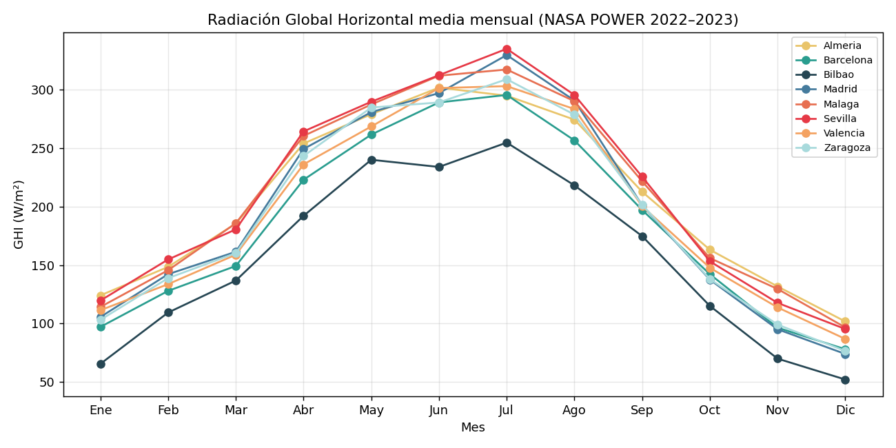
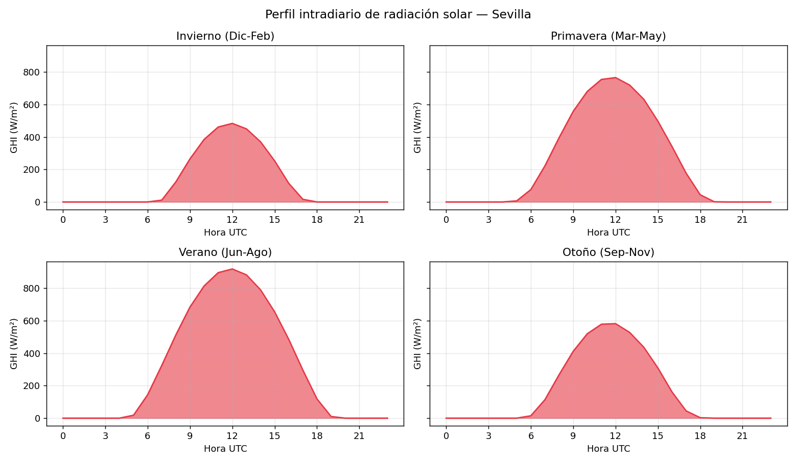
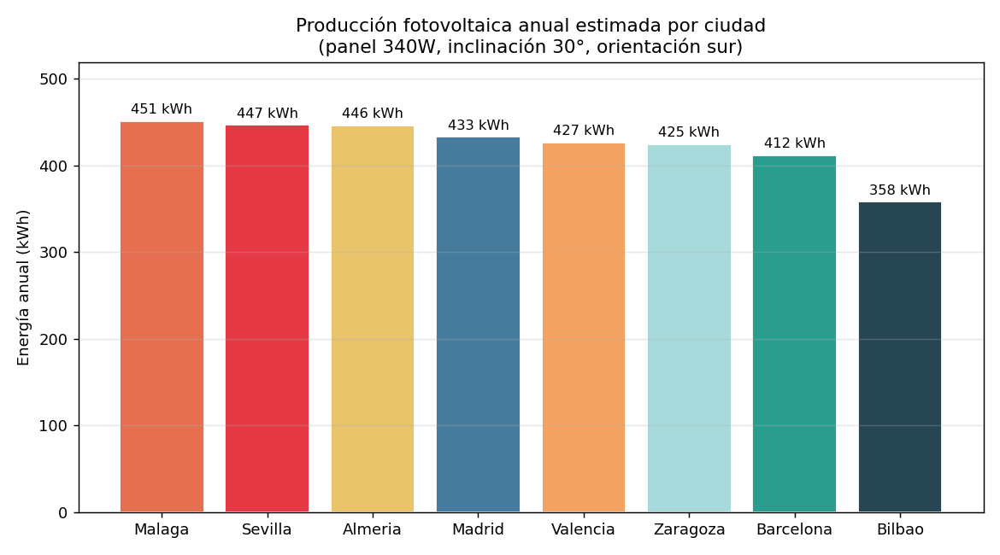
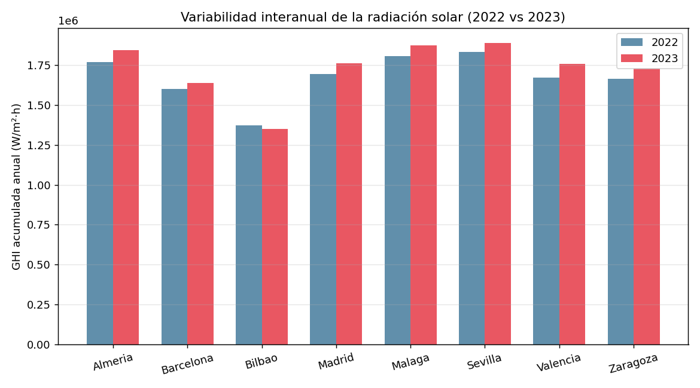
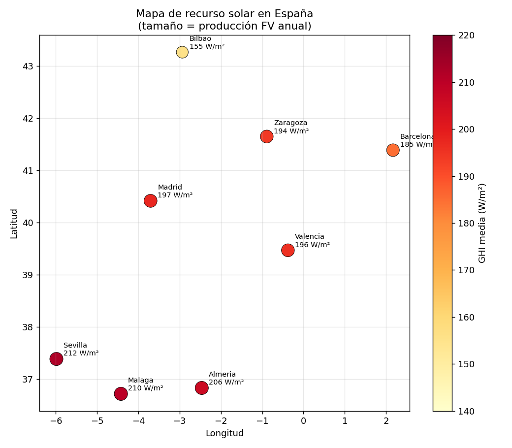

# Análisis de Radiación Solar y Potencial Fotovoltaico

## Datos y metodología

Datos horarios de NASA POWER para 8 ciudades españolas (2022–2023), 140,160 registros.
Variables: GHI, DHI, temperatura a 2m. Modelo de panel: 340W, inclinación 30°, orientación sur.

## 1. Radiación Global Horizontal mensual

El sur peninsular (Sevilla, Málaga, Almería) recibe consistentemente más radiación que
el norte (Bilbao), con diferencias máximas en verano. Todos los emplazamientos muestran
el patrón estacional esperado con pico en junio-julio.

## 2. Perfil intradiario por estación

En verano el día solar se extiende de 5h a 20h UTC, mientras en invierno se concentra
entre 8h y 16h. La irradiancia pico supera los 700 W/m² en los meses estivales.

## 3. Producción fotovoltaica anual

Málaga y Sevilla lideran con ~450 kWh anuales por panel, frente a los ~358 kWh de Bilbao.
El sur genera un **26% más energía** que el norte con el mismo equipamiento.

## 4. Variabilidad interanual

La diferencia entre 2022 y 2023 es inferior al 5% en todos los emplazamientos,
lo que indica una alta estabilidad del recurso solar en España.

## 5. Mapa de recurso solar

El gradiente norte-sur es evidente. Andalucía concentra el mayor potencial fotovoltaico,
con valores de GHI media superiores a 200 W/m².

## Conclusiones

- España tiene un recurso solar excelente, especialmente en Andalucía y Levante
- La producción fotovoltaica es predecible y estable interanualmente (<5% variación)
- Un panel estándar de 340W produce entre 358 kWh (Bilbao) y 451 kWh (Málaga) al año
- La corrección por temperatura es relevante: en verano las pérdidas térmicas reducen la eficiencia hasta un 15%

## Limitaciones

- Modelo POA simplificado (isotrópico), sin tracking solar
- Sin pérdidas de inversor, cableado ni suciedad (~15-20% en instalaciones reales)
- Datos satelitales con resolución espacial de 0.5°, no estaciones terrestres
